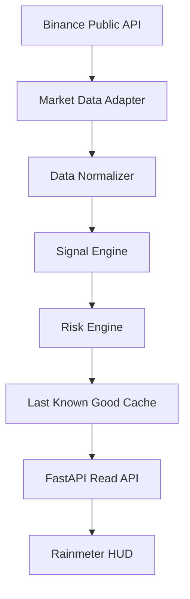
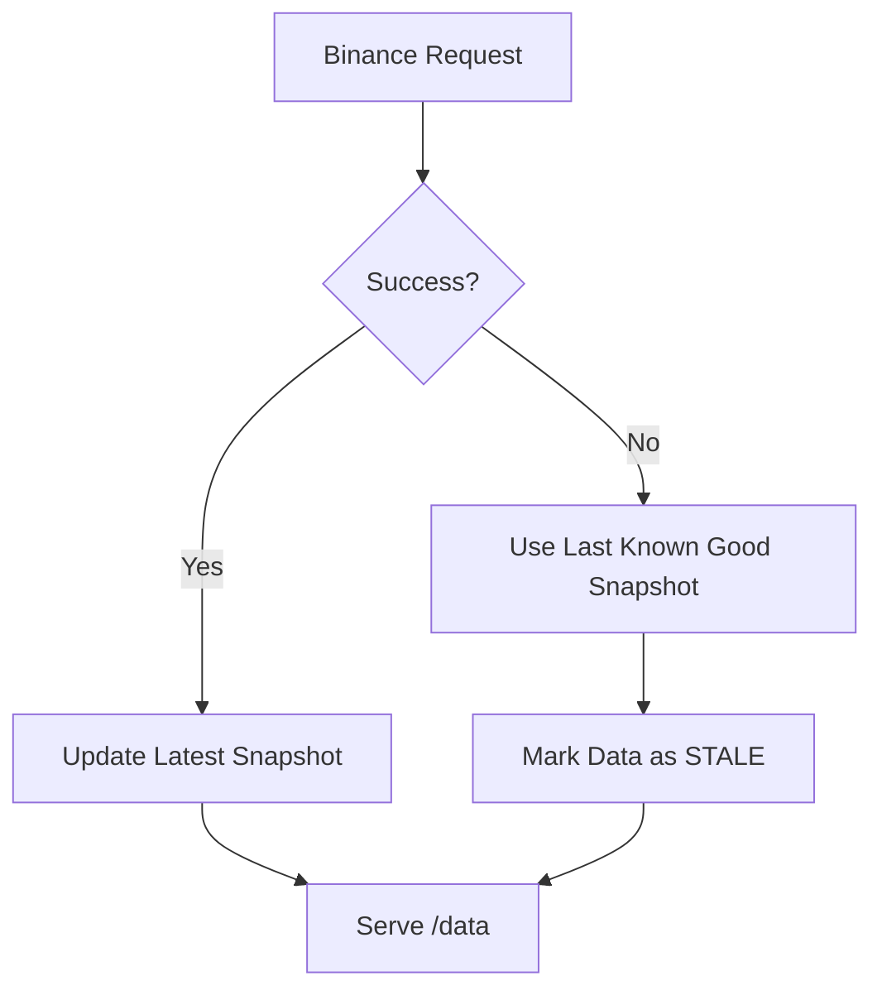

# Architecture

## Target Data Flow

## Failure Flow

## Runtime Components

- `api/app/services/binance_client.py`: Binance public REST adapter
- `api/app/services/market_data_service.py`: fetch + normalize + cache fallback
- `api/app/services/signal_engine.py`: placeholder signal rules
- `api/app/services/risk_engine.py`: monitoring-safe risk metrics
- `api/app/storage/cache.py`: in-memory last-known-good state
- `api/app/storage/jsonl_logger.py`: append-only JSONL logging
- `api/app/main.py`: FastAPI endpoints and API orchestration

## API Surface

- `GET /`: process liveness
- `GET /health`: API process health
- `GET /ready`: freshness-based readiness
- `GET /data`: typed HUD contract
- `GET /calendar`: static task list
- `GET /metrics`: request latency, Binance errors, staleness, last success

## Safety Boundary

This project remains monitoring-only:
- no order placement
- no account connections
- no private Binance endpoints
- no private key handling
- no portfolio execution logic
